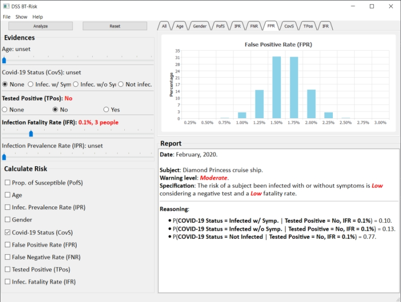

# DSS BT-Risk

This is a proof-of-concept (PofC) graphical user interface (using the PyQt library) for a decision suport system.
Under the hood it is running the Bayesian network ((using the PyAgrum library)) presented in the publication [1].

**Since it is a PofC, Several functionalities are missing!**

## Screenshot

## Publication

[1] H. C. R. Oliveira, V. Shmerko and S. N. Yanushkevich, "Decision Support for Infection Outbreak Analysis: the case of the Diamond Princess cruise ship," *2021 IEEE Symposium Series on Computational Intelligence* (SSCI), 2021, pp. 1-8, doi: [10.1109/SSCI50451.2021.9660140](https://ieeexplore.ieee.org/document/9660140).

## Code